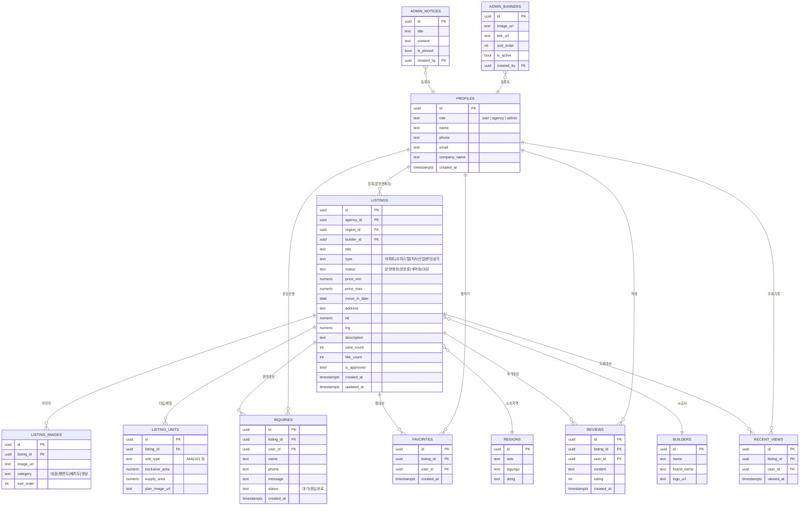

# RichLink ERD

## 설계 노트

- `profiles.role`로 일반회원/분양관계자/관리자를 구분하고, Supabase Auth의 `auth.users`와 1:1로 연결됩니다.
- `listings.is_approved`는 분양관계자가 등록한 매물이 관리자 승인을 거쳐야 노출되도록 하는 플래그입니다.
- 검색 성능을 위해 `listings(title, address)`에 PostgreSQL `pg_trgm` 기반 인덱스를, 인기 검색어 집계를 위해 별도 `search_logs` 테이블(선택)을 둘 수 있습니다.
- 지도 좌표(`lat`, `lng`)는 등록 시 카카오/네이버 지오코딩 API로 변환하여 저장합니다.
